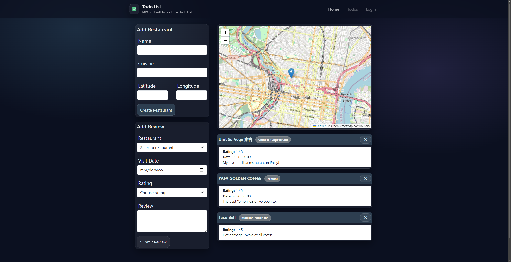

# Foodie Guide

A full-stack restaurant tracker. Log restaurants you've visited, pin them on an interactive map, and leave star-rated reviews for each one.

**🔗 Live demo:** [https://foodie-guide.onrender.com](https://foodie-guide.onrender.com)



## Features

- Dashboard listing all saved restaurants with their reviews
- Add a restaurant with a name, cuisine, and map coordinates
- Plot restaurants on an interactive [Leaflet](https://leafletjs.com/) map
- Leave a 1–5 star review with text and visit date for any restaurant
- Edit an existing review or delete a restaurant (and its reviews)

## Tech Stack

- **Backend:** Node.js, Express
- **Templating:** Handlebars (express-handlebars)
- **Database:** PostgreSQL via Sequelize ORM
- **Frontend:** Bootstrap, Leaflet, vanilla JS
- **Auth support:** bcrypt (password hashing on the `User` model)
- **Testing:** Jest

## Getting Started

### Prerequisites

- Node.js
- A local PostgreSQL server

### 1. Clone and install

```bash
git clone https://github.com/matthew-wilford/foodie-guide.git
cd foodie-guide
npm install
```

### 2. Configure environment variables

Copy `.env.EXAMPLE` to `.env` and fill in your local Postgres credentials:

```bash
cp .env.EXAMPLE .env
```

```env
DB_NAME='user_db'
DB_USER='postgres'
DB_PASSWORD='your_password'
```

Alternatively, set `DB_URL` to a full Postgres connection string (this takes priority over the individual `DB_*` variables and is what's used in production).

### 3. Seed the database

```bash
npm run seed
```

This creates the database if it doesn't exist, syncs the schema, and loads sample data.

### 4. Run the app

```bash
npm start
```

The app runs at [http://localhost:3001](http://localhost:3001).

## Project Structure

```
config/       Sequelize database connection
controllers/  Route handlers (restaurants, reviews)
models/       Sequelize models (User, Restaurant, Review)
routes/       Express route definitions
views/        Handlebars templates
public/       Static assets (CSS, client-side JS)
seeds/        Database seed script and sample data
```

## API Routes

| Method | Route                | Description                     |
| ------ | --------------------- | -------------------------------- |
| GET    | `/`                    | Renders the dashboard            |
| POST   | `/api/restaurants`     | Create a restaurant              |
| DELETE | `/api/restaurants/:id` | Delete a restaurant and its reviews |
| POST   | `/api/reviews`         | Create a review                  |
| PUT    | `/api/reviews/:id`     | Update a review                  |

## Deployment

Deployed on [Render](https://render.com) as a Web Service backed by a Render PostgreSQL instance, connected via the `DB_URL` environment variable.
